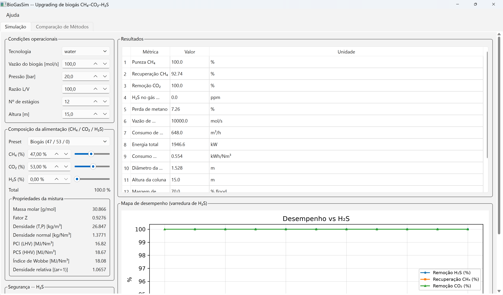

# BioGasSim

Simulador científico de **upgrading de biogás** (remoção de CO₂) em Python, modular,
orientado a objetos e de código aberto. Projeto, análise e comparação de processos de
purificação para produção de biometano a partir de biogás **47% CH₄ / 53% CO₂**.

> **Status (v0.2):** 149 testes passando. Absorvedor com Newton global e balanço de
> energia adiabático; especiação **Kent-Eisenberg** rigorosa (MEA/DEA/MDEA); hidráulica
> de coluna (flooding de Eckert, perda de carga de Stichlmair); estudos de sensibilidade
> paramétrica; solventes físicos (Selexol/Rectisol) e MDEA calibrados vs. literatura;
> **membranas multi-estágio** (mistura completa, reciclo do permeado, cascata em série);
> **CLI de casos** (composição variável, varredura paramétrica); **GUI** (PySide6/PyQt5);
> e **composição multicomponente** (CH₄/CO₂/N₂/O₂/H₂/H₂O/H₂S/NH₃/CO/Ar) com propriedades
> de gás e simulação em lote.
> Water Scrubbing e MEA validados ponta-a-ponta (ver [`docs/ROADMAP.md`](docs/ROADMAP.md)).

## Instalação

```bash
pip install -e .              # instala o pacote + o comando `biogassim`
# extras opcionais:
pip install -e ".[gui]"       # interface gráfica (PySide6)
pip install -e ".[excel]"     # export para .xlsx (openpyxl)
```

Requer Python ≥ 3.10, numpy, scipy, matplotlib, pandas.

## Como iniciar

Após a instalação, a **linha de comando (CLI)** fica disponível de duas formas
equivalentes — use a que preferir:

```bash
biogassim <comando>            # comando de console (requer a pasta de scripts do
                               # Python no PATH)
python -m biogassim.cli <comando>   # sempre funciona, sem depender do PATH
```

Veja todos os comandos com `biogassim --help`. Para abrir a **interface gráfica
(GUI)**: `biogassim gui` (detalhes na seção [Interface gráfica](#interface-gráfica-gui)).

## Uso rápido (CLI)

```bash
python -m biogassim.cli run-water          # lavagem com água (20 bar)
python -m biogassim.cli run-mea            # lavagem química com MEA (2 bar)
python -m biogassim.cli run-psa            # PSA (estimativa)
python -m biogassim.cli run-membrane       # membrana (1 estágio)
python -m biogassim.cli run-membrane-multi # membrana multi-estágio (reciclo/série)
python -m biogassim.cli compare            # tabela comparativa + gráficos
```

Resultados e gráficos são salvos em `examples_output/`.

### Casos e composição CH₄–CO₂ (Milestone 1)

Fluxo de trabalho baseado em *casos* (JSON) para estudar o efeito da composição
binária CH₄–CO₂ sobre desempenho, dimensionamento e economia:

```bash
biogassim new meu_projeto --tech water          # cria projeto + case.json padrão
biogassim set CH4=0.60 --case meu_projeto/case.json   # CO2 vira 0.40 (complemento)
biogassim run meu_projeto/case.json             # roda o caso, imprime métricas
biogassim props CH4=0.60 CO2=0.40 --P 20        # MM, Z, densidade, LHV/HHV, Wobbe, SG
biogassim sweep CH4=0.20:0.95:0.05 --out sweep.csv    # estudo paramétrico de composição
biogassim export results.xlsx --case meu_projeto/case.json
biogassim report --case meu_projeto/case.json   # relatório HTML
```

A composição é sempre normalizada (`xCH₄ + xCO₂ = 1`) e validada; a fração
complementar é atualizada automaticamente. O `sweep` varre a fração de CH₄ e
tabela pureza, recuperação, remoção de CO₂, perda de metano, consumo de
solvente/água, energia, diâmetro/altura da coluna, perda de carga, margem de
inundação e custo — a base dos mapas de desempenho.

### Misturas multicomponente e simulação em lote

A composição não é restrita a CH₄–CO₂: qualquer subconjunto dos gases
**CH₄, CO₂, N₂, O₂, H₂, H₂O, H₂S, NH₃, CO, Ar** é aceito (adicionar espécies é
só cadastrar em `Properties/components.py`, sem tocar no solver). A composição
pode ser dada em **fração molar, mássica ou volumétrica**, ou como **vazão molar
ou mássica** (`--basis mole|mass|volume|molar_flow|mass_flow`), sempre
normalizada.

```bash
biogassim props CH4=0.72 CO2=0.25 N2=0.03 --P 20    # propriedades de qualquer mistura
biogassim props CH4=0.5 CO2=0.5 --basis mass        # entrada em base mássica
biogassim batch feeds.csv --tech water --out results.csv   # centenas/milhares de feeds
```

O `batch` lê um CSV (uma linha por alimentação; colunas = espécies, + opcionais
`name`, `T_K`, `P_bar`, `basis`, `technology`) e calcula as propriedades de cada
mistura; com `--tech`, roda também o upgrading sobre a subcomposição CH₄/CO₂ e
reporta a fração inerte. **Nota:** o solver de absorção modela hoje a remoção de
CO₂ (CH₄/CO₂); N₂/O₂/H₂/Ar/H₂S entram como diluentes (aparecem nas propriedades,
não no balanço da coluna). Absorção multicomponente (ex.: H₂S) = roadmap.

### Interface gráfica (GUI)



Instale o extra da GUI (uma vez) e abra a janela principal:

```bash
pip install -e ".[gui]"        # instala PySide6 (alternativamente, tenha PyQt5)
biogassim gui                  # abre a janela principal
```

Três formas equivalentes de iniciar a GUI — use qualquer uma:

```bash
biogassim gui                  # comando de console
python -m biogassim.cli gui    # via a CLI (se `biogassim` não estiver no PATH)
python -m biogassim.gui.app    # inicia o pacote da GUI diretamente
```

Num desktop normal (Windows/macOS/Linux) a janela abre com fontes normais —
**não** defina `QT_QPA_PLATFORM=offscreen` (isso é apenas para testes headless).

#### Como usar a GUI

A GUI (PySide6 preferido, PyQt5 alternativo — via shim) é a camada interativa
sobre o mesmo motor de simulação da CLI. A janela tem cinco áreas:

- **Condições operacionais** (topo, à esquerda) — escolha a **tecnologia**
  (`water` ou `mea`) e ajuste vazão do biogás, pressão, razão L/V, número de
  estágios e altura da coluna. Trocar a tecnologia carrega os valores padrão
  correspondentes.
- **Composição da alimentação** (meio, à esquerda) — defina a mistura CH₄/CO₂ por
  um **preset** (biogás 47/53, digestor 60/40, aterro 50/50, metano puro), pelos
  **campos numéricos em %** ou pelos **sliders**. A composição é normalizada e a
  fração complementar é ajustada automaticamente (mexer no CH₄ atualiza o CO₂ e
  vice-versa). O bloco **Propriedades da mistura** recalcula em tempo real: massa
  molar, fator Z, densidade (a T,P) e normal, PCI/PCS (LHV/HHV), Índice de Wobbe
  e densidade relativa ao ar.
- **Solver** (base, à esquerda) — **Executar caso** roda a simulação com a
  composição e as condições atuais; **Varrer composição** roda o estudo
  paramétrico. A linha de status logo abaixo é o **monitor de convergência**
  (convergiu?, número de iterações, pureza e recuperação).
- **Resultados** (à direita) — tabela com pureza de CH₄, recuperação, remoção de
  CO₂, perda de metano, consumo de solvente/água, energia, diâmetro e altura da
  coluna, perda de carga, margem de inundação e custo específico.
- **Mapa de desempenho** (base, à direita) — gráfico de pureza e recuperação de
  CH₄ em função da fração de CH₄ na alimentação, gerado pela varredura.

**Fluxo típico de uso:**

1. Escolha a **tecnologia** no painel de condições operacionais.
2. Defina a **composição** (preset, campo `%` ou slider) — as propriedades da
   mistura são atualizadas a cada mudança.
3. Ajuste as **condições operacionais** (pressão, L/V, estágios, altura).
4. Clique em **Executar caso** — as métricas aparecem na tabela de resultados e o
   status mostra a convergência.
5. Clique em **Varrer composição** — o mapa de desempenho mostra como pureza e
   recuperação variam na faixa de CH₄ (20–95%).

Todos os cálculos reutilizam o mesmo núcleo da CLI (`biogassim.cases`); portanto,
para as mesmas entradas, GUI e CLI produzem resultados idênticos.

## Uso como scripts

```bash
python -m biogassim.Examples.WaterScrubbing
python -m biogassim.Examples.MEA
python -m biogassim.Examples.MembraneMultiStage   # 1 vs 2-estágios+reciclo vs série
python -m biogassim.Examples.CompareAll
```

## Uso programático

```python
from biogassim.UnitOperations import Stream, Absorber, AbsorberSpec
from biogassim.Solvents import WaterSolvent

species = ["CH4", "CO2", "H2O"]
gas = Stream.make(species, [0.47, 0.53, 0.0], flow=100.0, T=298.15, P=20e5, phase="vapor")
solv = Stream.make(species, [0.0, 0.0, 1.0], flow=10000.0, T=293.15, P=20e5, phase="liquid")
spec = AbsorberSpec(N_stages=12, packing="Pall_50", mode="isothermal",
                    T_op=293.15, pressure=20e5, height=15.0)
r = Absorber(gas, solv, WaterSolvent(), spec).solve()
print(r.purity_CH4, r.methane_recovery, r.CO2_removal, r.diameter)
```

## Arquitetura

```
biogassim/
  Core/             constantes, unidades, solver numérico, convergência
  Thermodynamics/   EOS (Peng-Robinson, SRK), Lei de Henry, fugacidade, flash
  Properties/       banco de componentes (CH4, CO2, H2O, N2, H2S, MEA, DEA, MDEA)
  MassTransfer/     difusão, teoria dos dois filmes, correlações (Re, Sc, Sh, HTU/NTU)
  Hydraulics/       recheios, flooding, perda de carga, diâmetro
  UnitOperations/   Absorvedor (estágios de equilíbrio), Stripper, Compressor, ...
  Solvents/         água (físico), MEA/DEA/MDEA (químico), Selexol, Rectisol
  PSA/              isoteras (Langmuir/Toth), ciclo PSA
  Membranes/        permeabilidades, modelo solução-difusão
  Optimization/     energia, economia, sensibilidade
  Export/           CSV, JSON, Excel, HTML (+ stubs PDF/Tecplot/VTK)
  Reporting/        gráficos (matplotlib)
  Examples/         casos prontos
  cli.py            linha de comando
tests/              pytest
docs/               documentação
```

Ver [`docs/ARCHITECTURE.md`](docs/ARCHITECTURE.md) e [`docs/ROADMAP.md`](docs/ROADMAP.md).

## Tecnologias implementadas

| Tecnologia | Estado | Observação |
|---|---|---|
| Water Scrubbing | ✅ funcional | alta pressão, água recirculada |
| MEA (amina química) | ✅ funcional | baixa pressão, reboiler; Kent-Eisenberg calibrado (Aronu 2011) |
| DEA / MDEA | ✅ / ~ | Kent-Eisenberg rigoroso; MDEA calibrado (VLE, Huttenhuis 2007), DEA a calibrar |
| Selexol / Rectisol | ✅ funcional | solventes físicos (Henry), calibrados vs. literatura |
| PSA | ~ estimativa | isoterma + seletividade; ciclo dinâmico = roadmap |
| Membranas | ✅ 1 e multi-estágio | mistura completa (resolve θ); 1 estágio, 2-estágios + reciclo, cascata em série |

## Validação

Comparações contra literatura (ver `tests/test_validation.py`):

- Solubilidade de CO₂ em água a 25 °C (0,034 mol/(L·atm)) e fatores de
  compressibilidade (Z) via Peng-Robinson.
- Equilíbrio MEA vs. Aronu (2011) e MDEA vs. Huttenhuis et al. (2007).
- Solventes físicos (Selexol/Rectisol) vs. dados de solubilidade
  (Henni 2005, Décultot 2019, Leu & Robinson 1992).
- Fechamento de balanço de massa do flash e do absorvedor (~1e-9 ou melhor).

Validação sistemática contra Aspen Plus/DWSIM é meta futura (ROADMAP).

## Desenvolvimento

```bash
pip install -e ".[dev,excel,gui]"   # pytest, pytest-cov, ruff, openpyxl, PySide6
pytest -q                       # roda os 149 testes (GUI é pulada sem Qt instalado)
pytest --cov=biogassim          # com cobertura
ruff check biogassim tests      # lint
ruff check --fix biogassim tests   # corrige o que for auto-corrigível
```

A integração contínua (GitHub Actions, `.github/workflows/ci.yml`) roda lint e testes
em Python 3.10, 3.11 e 3.12 a cada push e pull request.

## Licença

MIT — ver [`LICENSE`](LICENSE).
